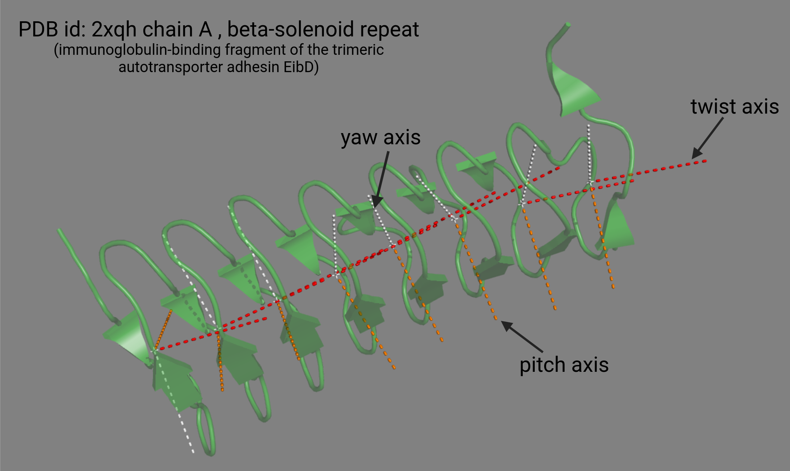

# GeomeTRe documentation
**GeomeTRe** is a Python package developed to calculate geometrical parameters of repeat proteins. Repeat proteins are characterized by repeated patterns in their structures, and understanding their geometry—such as curvature, twist, and pitch—is essential for studying their stability and classification. **GeomeTRe** uses data from RepeatsDB and PDB structures, employing method of circular fitting to provide fast and accurate analysis of these parameters, offering a comprehensive solution for structured tandem repeat proteins -**STRPs**.

## Installation
The software can be installed with pip or used without installing it a library or as a command line tool.

#### Command line tool

To use the package as a command-line tool without installation, ensure the paths are set in your environment.

Example:
`export PYTHONPATH="${PYTHONPATH}:/home/user/Desktop/GeomeTRe/src/geometre"`

#### PIP installation
To install the package directly from GitHub:
`pip install git+https://github.com/BioComputingUP/GeomeTRe.git`

Check the installation:
`pip list | grep GeomeTRe`  or `geometre --help`

Uninstall package:
`pip uninstall geometre`

## Command line syntax for single mode
`geometre single input_path chain units_def -ins insertion -o output_path --draw`

- single: single file mode
- input_path: path to .pdb or .cif file to analyze
- chain: chain to analyze
- units_def: repeat unit star and end positions, written as s1_e1,s2_e2, etc.
- ins insertions: insertion start and end positions, written as the units
- -o output_path: the output of the program will be saved as a csv file within the specified, existing directory 
- --draw: if used, the output will include a PyMOL drawing of the protein structure

Use -h option to display help information.

Example:

`geometre single /your_dir/2xqh.pdb A 161_175,176_189,190_203,204_217,218_233,234_249,250_263,264_276,305_326,327_350,373_392,393_416 -ins 351_372 -o result.csv --draw`

process.log file is generated to help track the operations.

## Command line syntax for batch mode
`geometre batch --batch input_path/input_file.tsv --output output_path/output.file.csv --format [pdb or cif] --threads number_of threads --pdb_dir dir_of_pdb_structures`

- batch: single mode
- input_file.tsv is a tab separated file with 3 columns: the pdb id+chain (ex:2xqhA), units repeat units' star and end positions, written as s1_e1,s2_e2, etc, and insertion (NA if no insertions)
- output_file.csv is the path to the output file in a csv format:
- format: format of input file of protein structures (pdb or cif)
- threads: number of jobs to run in parallel
- pdb_dir: directory of pdb structures downloaded

Example: 

`geometre batch --batch test.tsv --output results_batch.csv --format pdb --threads 5 --pdb_dir home/user/pdb_dir/`

process.log file is generated to help track the operations.

## Required Dependencies
This package requires the following dependencies to run:
- Python 3.6 or higher
- Required Python packages (installed automatically via `pip install`):
  - numpy
  - pandas
  - scikit-learn
  - scikit-image
  - biopython
  - tmtools
  - requests
- **PyMOL**: PyMOL must be installed via `conda` before running the package if you intend to use the `--draw` option.
    conda install -c conda-forge pymol-open-source

## CALCULATION OF PARAMETERS

### Rotation

The tool first computes the rotation between units in the following way:
Starting with sliding windows of 6 units, projecting them on a plane with PCA, and finding the rotation center as the center of the widest circular crown containining all of them. Then reverse the PCA transformation to get the center of rotation in the 3D space. After for each pair of units, it finds a center of rotation for that pair as the center of rotation found by a window including that pair the corresponded to the largest crown.

### Twist, pitch and handedness

We proceed selecting a sliding pair of consecutive units. Then for each unit of the pair, the program computes two reference axes (twist and pitch axis).
The pitch axis is the vector connecting the geometric center to the center of rotation relative to that pair. The twist axis is the vector connecting the two barycenters, orthogonalized w.r.t. the two different pitch axes. Then for each pair of units, we rotate them to bring their axes into correspondence to the standard axes (twist to (1,0,0), pitch to (0,1,0)). We use TM-align to find the best rotation that overlaps the first unit to the second one. Then we decompose the rotation of the alignment w.r.t. the reference axes of the first unit to find the pitch, twist and handedness, using Euler angles. 

## Outputs

 - single mode has two outputs: a table with the computed parameters, and a pymol drawing of the geometry of the molecule.

 	csv table content :
 	- pdb id: the PDB id of the molecule
 	- chain: chain of PDB structure
 	- unit_start: start position of repeat unit
 	- unit_end: end position of repeat unit
 	- Curvature: the curvature, computed as the angle between the vectors connecting the rotation center to two consecutive units
 	    - Twist: the twist, computed as the component of the rotation that aligns the two units w.r.t. the twist axis
 	    - Twisthandedness: computed as the handedness of the rotation, w.r.t. the twist axis
 	    - Pitch: the pitch, computed the same way as the twist, but orthogonalizing w.r.t the pitch axis
 	    - Pitchhandedness: computed as the handedness of the rotation, w.r.t. the pitch axis.
 	    - TM-score: the tm-score of the structural alignment
 	    - Yaw: the residual yaw rotation: in a perfect structure, this is 0, as we already compensate for the yaw when we align the axes of the two units to the standard reference axes. A high yaw 
 	      means a bad performance on the algorithm for that unit pair.
 Additionally, last 2 rows are showing mean and standard deviations of each parameter. The first row is all zeros, since the rows refer to the unit and the unit before it.

	PyMOL drawing contains the following axis:
	    - In red, twist axis of each repeat unit(RU) which is always parallel to the longest dimension of the protein
	    - In orange, twist axis of each RU
	    - In white, yaw axis of each RU
The example of PyMOL drawing in png format with explanation text is below

 - batch mode output:
 	- pdb id: the PDB id of the molecule
	- chain: chain of PDB structure
	- curv_mean: mean of curvature
	- curv_std: standard deviation of curvature
	- twist_mean: mean of twist
	- twist_std: standard deviation of twist
	- twist_sign_mean: mean of twist handedness
	- twist_sign_std: standard deviation of twist handedness
	- pitch_mean: mean of pitch
	- pitch_std: standard deviation of pitch
	- pitch_sign_mean: mean of pitch handedness
	- pitch_sign_std: standard deviation of pitch handedness
	- tmscores_mean: mean of tmtool score
	- tmscores_std: standard deviation of tmtool score
	- yaw_mean: mean of yaw
	- yaw_std: standard deviation of yaw

### input_repeatsdb_v4_filtered.tsv
tsv file containining the proteins in the RepeatsDB database (version 4) for batch mode calculations.

